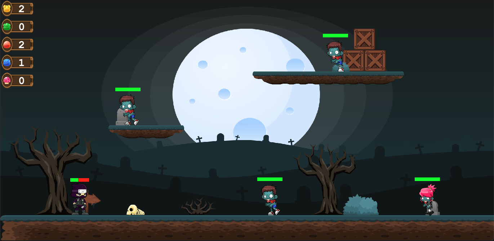

# Ninja-Game
A 2D side-scrolling game built with Java. See the [demo](https://youtu.be/S92kdNGZjdc).




# How to run the game
## Compile the code
Make sure you have Java Development Kit (JDK) installed. You can compile the code using
```bash
javac -cp . -sourcepath src -d out src/*.java
```

## Run the game
After compiling, you can run the game using the following command:
```bash
java -cp out Main
```

## Makefile
You can also use the provided Makefile to compile and run the game. Just type:
```bash
make
```
